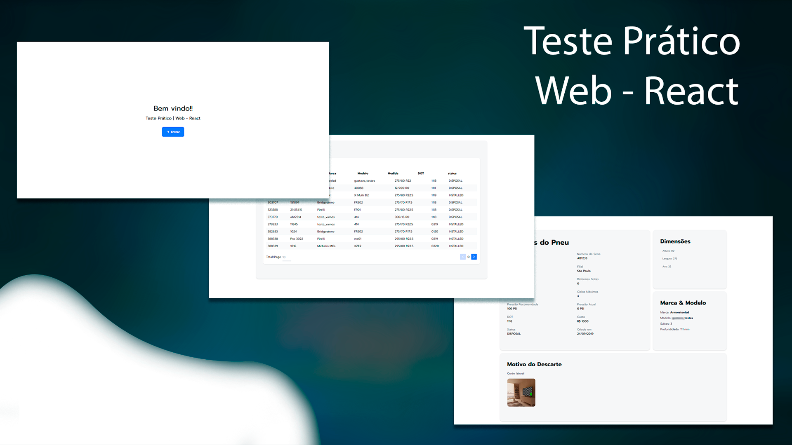

<h1 align="center">
  Teste Prático Web - React
</h1>

 

  

## ✨ Tecnologias

Esse projeto foi desenvolvido com as seguintes tecnologias:

- [React JS](https://pt-br.reactjs.org/)
- [Typescript](https://www.typescriptlang.org/)
- [ViteJS](https://vitejs.dev/)
- [Tailwindcss](https://tailwindcss.com/)
- [Vitest](https://vitest.dev/)

## 💻 Projeto

Aplicação foi desenvolvida como teste prático para o cargo de Desenvolvedor Front End React | Pleno no mes de julho de 2025.

## 📚 Descrição

  Desenvolvimento de uma aplicação web para listagem e exibe detalhes de pneus.

## 📋 Requisitos
  1. Deve utilizar ReactJS puro para o desenvolvimento da aplicação.
  2. Deve utilizar Typescript.
  3. Pode utilizar algum sistema de gerenciamento de estado se achar necessário.
  4. Deve montar um sistema de rotas com a biblioteca de sua escolha.
  5. Deve considerar lidar com casos de erro nas requisições, para garantir uma experiência de usuário robusta.
  6. Deve criar duas páginas (Lista e Detalhes) para exibir os dados de pneus.
    6.1. Pagina listagem:
      - Deve utilizar o endpoint de listagem de pneus (GET -> /api/v3/tires)
      - Deve exibir todos os pneus de forma paginada.
      - Pode adicionar filtros.
    6.2. Pagina detalhes:
      - Deve utilizar o endpoint de detalhes de um pneu (GET -> /api/v3/tires/{id})
      - Deve exibir os detalhes de um pneu.
  7. Devem conter testes de integração de maneira automatizada.

## 🚀 Como executar

- Clone o repositório
- Instale as dependências com `npm install`
- Inclua o arquivo `.env` com as variáveis de ambiente necessárias seguindo o modelo `.env.exemple`
- Inicie o projeto em modo desenvolvedor com `npm run dev`
- Acesse a aplicação em `http://localhost:5173` porta default do ViteJS

## 📋 Como rodar os testes

- Execute o comando `npm run test`
- Execute o comando `npm run test:coverage` para gerar o relatório de cobertura

## 📋 Como rodar o deploy

- Execute o comando `npm run deploy`

## 📄 Arquivos

- `.github` -> Pasta com os arquivos de configuração do GitHub
- `public` -> Pasta com os arquivos estáticos do projeto
- `src` -> Pasta com o código fonte do projeto
- `test` -> Pasta com os arquivos configuração global de execução dos testes
- `.env.example` -> Arquivo de exemplo de configuração do .env
- `.gitignore` -> Arquivo de configuração do Gitignore
- `eslint.config.js` -> Arquivo de configuração do ESLint
- `index.html` -> Arquivo de configuração do reactJs
- `package-lock.json` -> Arquivo de configuração do projeto
- `package.json` -> Arquivo de configuração do projeto
- `README.md` -> Arquivo de documentação do projeto
- `tsconfig.app.json` -> Arquivo de configuração do TypeScript
- `tsconfig.json` -> Arquivo de configuração do TypeScript
- `tsconfig.node.json` -> Arquivo de configuração do TypeScript
- `vite.config.ts` -> Arquivo de configuração do ViteJS
- `vitest.config.ts` -> Arquivo de configuração do VitestJS

## 🔧 Descição do projeto

- ViteJS: A escolha pelo vite vem pelos seguinte ponto por se tratar de um projeto pequendo com base de valiar as habilidade Front End ReactJs, o vite traz uma maior velocidade no starde do projeto, tendo configurações simplificadas, uma recaregamento rapido, tamanho do pacotes otimizados e suporte ao ES6.

- Tailwindcss: Outra ferramenta que traz maior agilidade no desenvolvimento, de facil configuração e totalmente compativel com o viteJs com React.Js, mesmo não solicitado nos requisitos o taiwindcss já traz com ele a facilidade de trabalhar com responsividade e tem facil personalização, como foi fornecido um "Style Gride" para ter um embasamento do aspecto visual, o taiwindcss se encaixou bem ao desenvolvimento.

- Vitest: O esse foi uma escolha inicialmente que me touse duvida, mas pesquisando mais a funda essa ferramenta pude comprovar uma escolha acertiva, começando com a facilidade de integração, com poucos passoas a configuração está realizada, seu gerenciamento inteligente ao executar os testes, proximidade com o Jest, maior velocidade, e integração completa com o ViteJs e React, tambem dando suporte a TypeScrip.

- Axios: O axios foi escolhido por se tratar de uma biblioteca de integração com a API, ele traz varias funcionalidades que contribuem para uma aplicação tratamento de erros, configuração de cabeçalho, tratamento de erros e muito mais, com isso o axios traz facilidade ao desenvolvimento, como se tratava de uma aplicação com apenas 2 rotas de Api mesmo o fetch já atenderia a aplicação, tem que realizar algumas operações mais manuais, mas o axios da maior robustes a aplicação.

## Documentação componente

 - dataTable:
    Props:
      - **columns**: Array de objetos com as informações da coluna `dataTableColumnType`
        - `dataTableColumnType`
          - **uniqueId**: string - Identificador único da coluna
          - **label**: string - Label da coluna
          - **render**: Função que será chamada para renderizar o conteúdo da coluna
          - **className**: string - Classe CSS da coluna
          - **avoidRowClick**: boolean - Indica se a linha da tabela deve ser clicável
      - **onRowClick**: Função que será chamada ao clicar em uma linha da tabela
      - **dataService**: Função que será chamada para obter os dados da API

 - Button: 
  > Extende as propriedades de uma tag HTML `button`
    Props adicional: 
      - mode: string - Define o modo do botão ('base' | 'outline' | 'text')

 - Card:
  > Extende as propriedades de uma tag HTML `div`

 - GoBackButton:
    Props:
      - **href**: string - Define o href do botão para que pagina irá direcionar, default: '/'

 - Input:
  > Extende as propriedades de uma tag HTML `input`
   Props adicionais:
    - **icon**: ReactNode - Define o ícone do input
    - **label**: string - Define o label do input
    - **containerClassName**: string - Define o className do container do input

 - Loading:
   Props:
    - **className**: string - Define o className do loading

 ### Função de renderização de notificações
  - toastSuccess:
    Props:
      - **content**: Define o conteúdo da notificação
      - **options**: Define as opções da notificação
  - toastWarning:
    Props:
      - **content**: Define o conteúdo da notificação
      - **options**: Define as opções da notificação
  - toastInfo:
    Props:
      - **content**: Define o conteúdo da notificação
      - **options**: Define as opções da notificação
  - toastError:
    Props:
      - **content**: Define o conteúdo da notificação
      - **options**: Define as opções da notificação
  
  > exemplo chamada: `toastSuccess('Sucesso')`

  ### Hooks
    - useTire:
      Props:
        - **tire**: Objeto - resoltado da busca pelo tireId
        - **isLoading**: boolean - Indica se a busca pelo tireId está em andamento
        - **currentId**: number|null - Id do tire atual
        - **handleCurrentDetail**: Função que será chamada ao clicar em uma linha da tabela atualiza `currentId`
